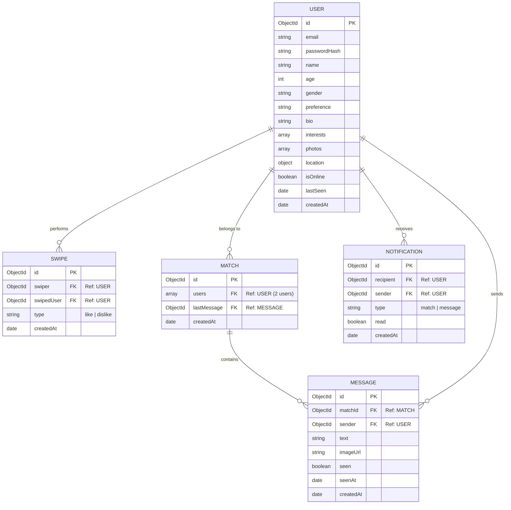
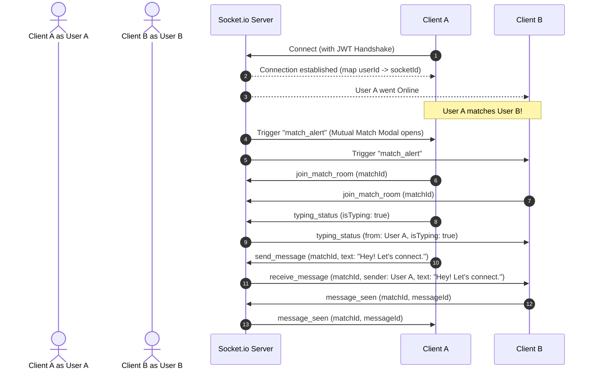

# Phase 1: Tinder-Clone System Design

Welcome to **Phase 1 (System Design)**. As the Lead Full-Stack Software Architect, I have designed this Tinder-clone application to be secure, real-time, responsive, and ready for deployment. This document defines the architectural blueprint of our application before we write any code.

---

## 1. Overall Architecture

The application adopts a decoupled Client-Server architecture. The React SPA frontend communicates with the Express.js backend via **HTTP REST APIs** (for stateless transactions) and **WebSockets via Socket.io** (for stateful real-time interactions).

```mermaid
graph TD
    subgraph Client Layer (Mobile First)
        React[React SPA]
        Ctx[Context API Store]
        Vite[Vite Bundler]
        Tailwind[Tailwind CSS]
        Framer[Framer Motion Engine]
    end

    subgraph API Gateway & Server Layer
        Express[Express.js App]
        JWTAuth[JWT Guard Middleware]
        RateLimit[Helmet & Rate Limiter]
        SocketIO[Socket.io WS Server]
    end

    subgraph Data & Cloud Services
        MongoDB[(MongoDB Atlas)]
        Cloudinary[Cloudinary Image CDN]
    end

    React <-->|HTTPS REST + JWT| Express
    React <-->|WebSockets| SocketIO
    Express -->|Mongoose ODM| MongoDB
    Express -->|SDK Uploads| Cloudinary
    SocketIO -->|Session Queries| MongoDB
```

---

## 2. Frontend-Backend Communication

### RESTful API Layer (Stateless)
- **Transport**: HTTP/2 over SSL.
- **Data Format**: JSON for requests and responses, `multipart/form-data` for image uploads.
- **Endpoints Structure**: Organized by resource domains:
  - `/api/auth` — Registration, Login, Logout, Refresh Token.
  - `/api/users` — Profile CRUD, Discovery feed generation.
  - `/api/swipes` — Swipe transactions (like/dislike trigger).
  - `/api/matches` — Fetch active matches, match details.
  - `/api/messages` — Fetch message history for a match room.

### Real-Time WebSocket Layer (Stateful)
- **Transport**: Engine.io / WebSockets (via `Socket.io`).
- **Authentication**: JWT verification during the connection handshake.
- **Events Matrix**:
  - `join_match_room`: Subscribes a client to a specific match conversation channel.
  - `send_message` / `receive_message`: Delivers real-time message bubbles inside a match room.
  - `typing_status`: Notifies the recipient when the user starts/stops typing.
  - `message_seen`: Delivers seen receipts when the recipient opens the active match room.
  - `online_status`: Informs active match channels of online/offline transitions.

---

## 3. Database Design (Entity-Relationship)

We use MongoDB for its schema flexibility, document nesting (ideal for user profiles and photo objects), and horizontal scalability. Below is the Entity-Relationship Diagram (ERD) mapping the collections:



---

## 4. Authentication Flow (JWT with HttpOnly Cookies)

To guarantee high security and prevent XSS (Cross-Site Scripting) and CSRF (Cross-Site Request Forgery) attacks:
1. **Access Token**: Short-lived (15 minutes). Loaded into memory on the client side (React state).
2. **Refresh Token**: Long-lived (7 days). Saved as an `HttpOnly`, `Secure`, `SameSite=Lax` cookie on the server.
3. **Token Rotation**: The client uses an Axios response interceptor to automatically catch `401 Unauthorized` errors, requests a new access token using the HttpOnly refresh token via `/api/auth/refresh`, and transparently retries the failed API call.

```
Client (React)                  API Server (Express)               Database
    |                                   |                             |
    |---- 1. POST /login -------------->|                             |
    |                                   |-- 2. Verify Credentials --->|
    |                                   |<-- 3. Return User Record ---|
    |                                   |                             |
    |                                   |-- 4. Sign JWT Access Token  |
    |                                   |      & Refresh Token        |
    |                                   |                             |
    |<--- 5. Response ------------------|                             |
    |     - JSON { user, accessToken }  |                             |
    |     - Cookie: refreshToken        |                             |
    |       (HttpOnly, Secure)          |                             |
    |                                   |                             |
```

---

## 5. Socket.io Event Lifecycle Flow

When a user opens the application, the Socket connection establishes a persistent duplex communication channel.



---

## Next Steps

With Phase 1 (System Design) documented, we are ready to move to **Phase 2 (Project Setup)**. We will set up Vite for the frontend and Express for the backend, install the dependencies, and configure environment templates.

Let me know when you're ready to proceed to Phase 2!
